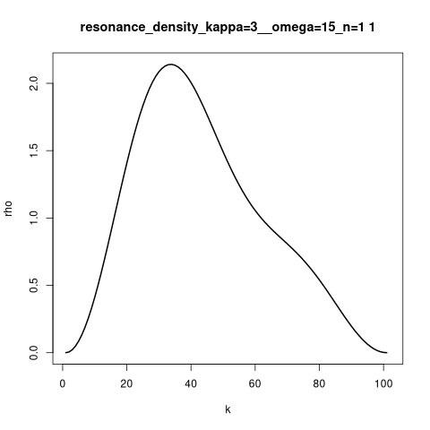
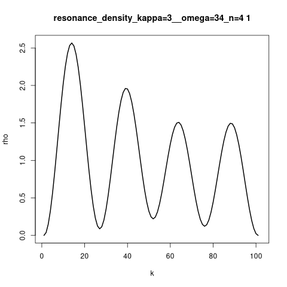

# Simulation of 1D time dependent Schrödinger equation

|  	    |  	|
| :----:	|:----:	|
| n 1->2 	    | n 4->3 	|

Plots:
```
<x> (tau)
Eta (tau)
N (tau) - norm
```

```
rho (k - index) (3 state - initial - tau1, middle - tau2, finish -tau3)
```

Animation
```
rho (k - index) for every tau 
```


Remember of `-O3` flag.